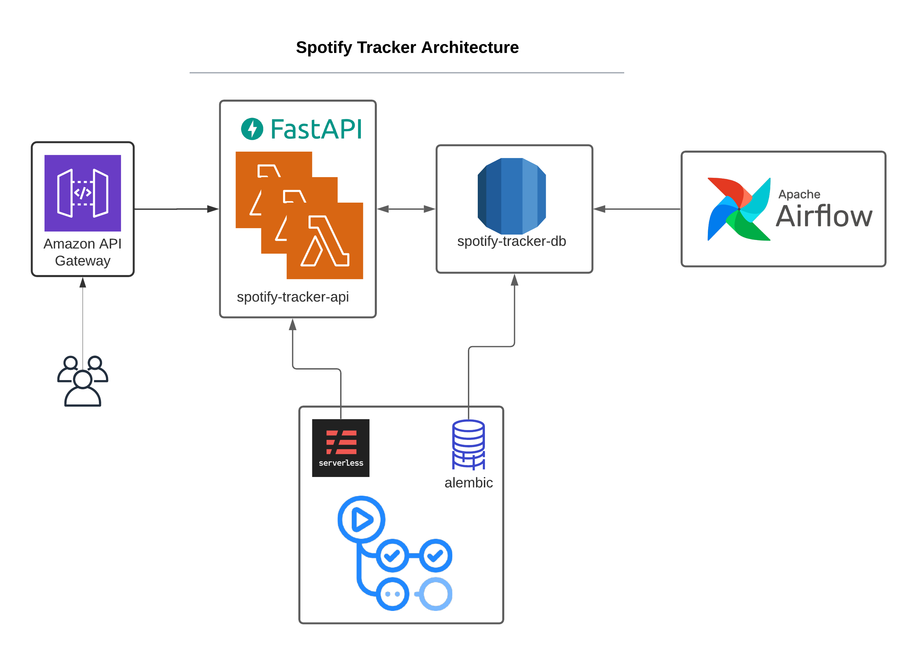

# Spotify Tracker

A Spotify API to collect statistics from users played musics.
Built with FastAPI, Apache Airflow, AWS RDS, AWS API Gateway, AWS Lambda, Serverless and Github Actions.

## API

The API was built using FastAPI, and uses Oauth2 for authentication and ormar as a Database ORM.
It connects the user to a Spotify App and the Spotify API to collect information about the users played tracks.
The user can check the unique tracks and artists, and build a profile with the audio features and genres.

## ETL

The app uses Apache Airflow to perform ETL tasks and collect the user played tracks, tracks audio features and artists information.

## Database

The database is hosted on AWS RDS.

## Serverless

The app uses the serverless framework to deploy the application on API Gateway using Lambda Functions.

## CI/CD

With the use of Github Actions the serverless deployment and database migration processes are automated.

## Development and Deployment

If using `vscode`, a `devcontainer` configuration for local development is available.

### FastAPI

Create a Spotify App on <https://developer.spotify.com/dashboard/>

Set the following environment variables:

- SECRET_KEY: random string used to create jwt tokens
- ALGORITHM: algorithm used to create jwt tokens
- ACCESS_TOKEN_EXPIRE_MINUTES: duration of the jwt tokens

- CLIENT_ID: spotify app client id
- CLIENT_SECRET: spotify client app secret
- OAUTH_AUTHORIZE_URL: spotify authorize url
- OAUTH_TOKEN_URL: spotify token url
- REDIRECT_URI: spotify app redirect url
- SCOPE: scopes necessary for the app = 'user-read-private user-read-email user-read-recently-played'
- B64_CLIENT: client id and secret base 64 encoded

- APP_DB_CONNECTOR: db connector = postgresql
- APP_DB_USERNAME: db username
- APP_DB_PASSWORD: db password
- APP_DB_HOST: db host
- APP_DB_PORT: db port
- APP_DB_DATABASE: db name

Run the app with the provided `Dockerfile` or by installing the app package and running: `uvicorn app.api.main:app`

### Airflow

Set the following environment variables in addition to the FastAPI ones:

- AIRFLOW_EMAIL: email to send airflow tasks messages
- AIRFLOW_UID: airflow user id = 1000
- AIRFLOW_GID: airflow group id = 0
- _AIRFLOW_WWW_USER_USERNAME: airflow webserver user name
- _AIRFLOW_WWW_USER_PASSWORD: airflow webserver password

The etl folder contains the `Dockerfile` and `docker-compose` necessary for deploy.
Create the volumes folders: `$ mkdir ./logs ./plugins`
Create the database: `$ docker-compose up airflow-init`
Start the containers: `$ docker-compose up -d`

If running locally use the following:

- Init airflow db: `airflow db init`
- copy the `etl/dags` folder to `~/airflow/dags/`
- List dags: `$ airflow dags list`
- Run dag: `$ airflow dags test spotify_etl 2015-06-01`

### DB

Set the following environment variables in addition to the FastAPI ones:

- FIRST_ADMIN_ID: id of the admin user when creating a fresh database
- FIRST_ADMIN_EMAIL: email of the admin user when creating a fresh database
- FIRST_ADMIN_PASSWORD: password of the admin user when creating a fresh database

### serverless framework

The serverless api deploy is done with the serverless framework.

- Install serverless globally: `$ npm install -g serverless`
- Install the plugins: `$ npm install`
- Configure aws credentials for serverless
- To deploy the api: `$ sls deploy --region "us-east-1" --stage "dev"`
- To invoke the api: `$ sls invoke -f app --path data.json --log`
- To remove the resourses created: `$ sls remove --region "us-east-1" --stage "dev"`

### Github Actions

The Github Actions are responsible to update the deploy and execute db migration automatically on new releases.
