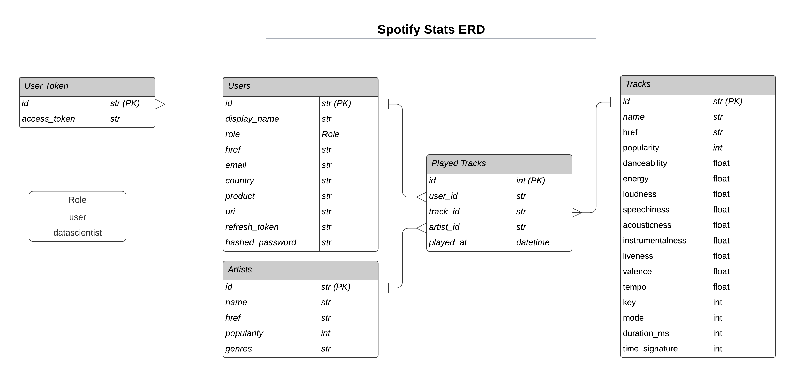
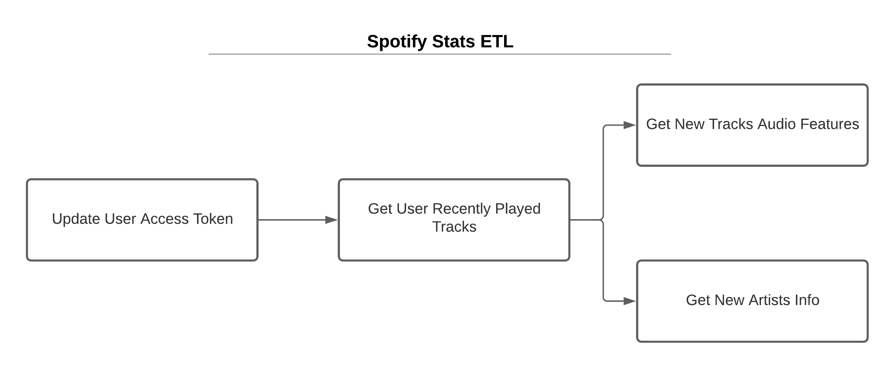

# spotify-stats

A Spotify API to collect statistics from users played musics

- Add environment variables: `$ set -a; . .env; set +a`
- Init airflow db: `airflow db init`
- Remove examples from dags: `$ sed -i 's/load_examples = True/load_examples = False/g' ~/airflow/airflow.cfg`
- Create a file in `~/airflow/dags/add_dag_folders.py` with the contents bellow to add the `spotify_etl` dag.

```python
import os
from airflow.models import DagBag
from app import etl
from pathlib import Path


dags_dirs = [str(Path(etl.__file__).parent.absolute())]

for dir in dags_dirs:
    dag_bag = DagBag(os.path.expanduser(dir))

    if dag_bag:
        for dag_id, dag in dag_bag.dags.items():
            globals()[dag_id] = dag
```

- List dags: `$ airflow dags list`
- Run dag: `$ airflow dags test spotify_etl 2015-06-01`
- Server api: `$ uvicorn app.api.main:app`




- `$ npm install -g serverless`
- `$ npm install`
- Configure aws credentials for serverless
- `$ sls deploy --region "us-east-1" --stage "dev"`
- `$ sls invoke -f app --path notebooks/data.json --log`
- `$ sls remove --region "us-east-1" --stage "dev"`
